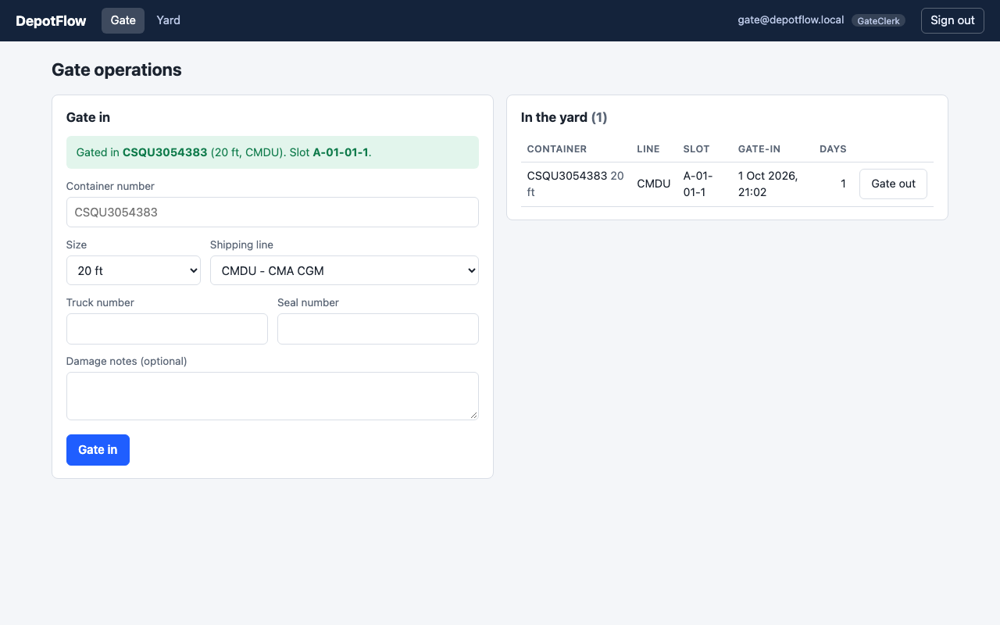
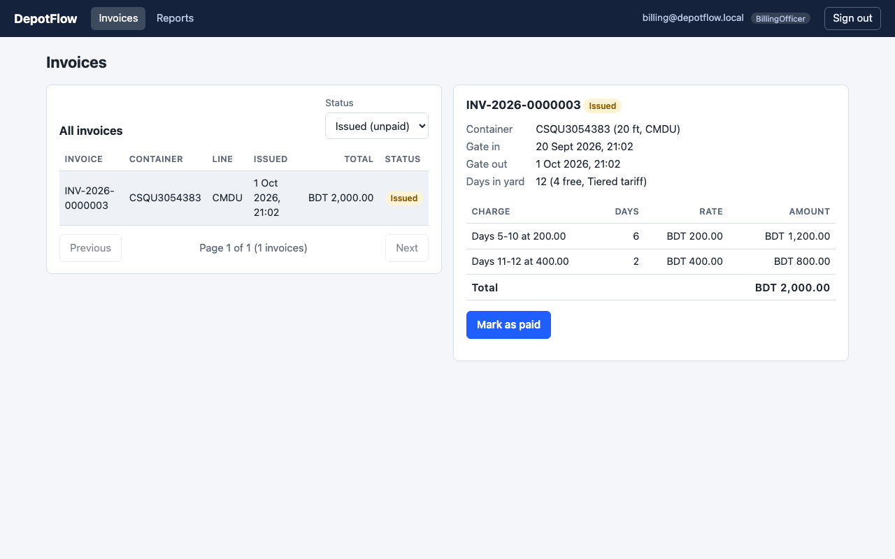
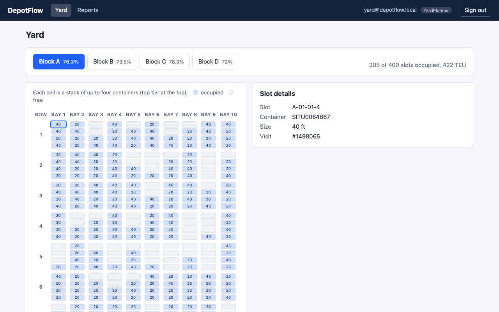
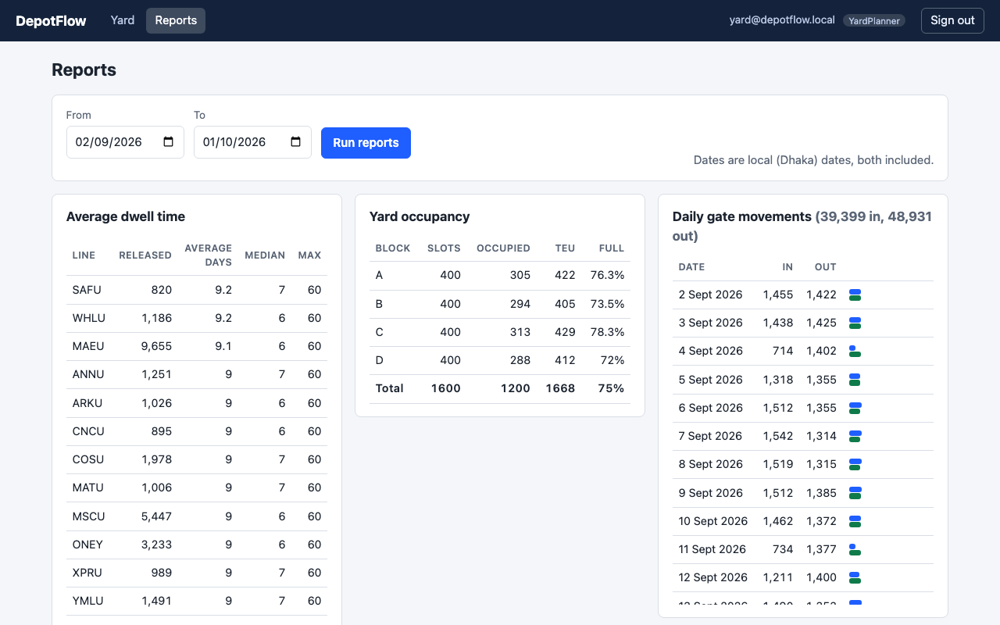
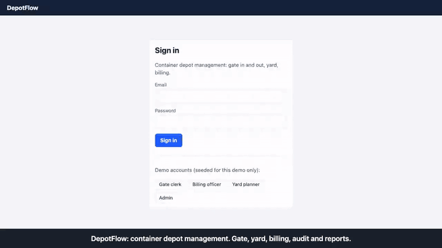
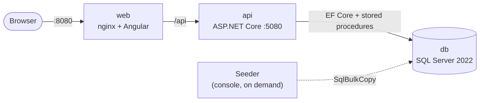
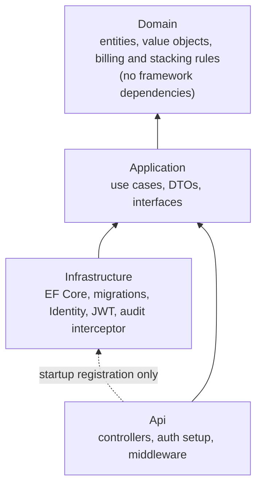

# DepotFlow

[](https://github.com/habibour/DepotFlow/actions/workflows/ci.yml)

A container depot management system: trucks bring shipping containers in and out, the yard keeps track of where every container stands, and storage is billed by the day. Built with ASP.NET Core, EF Core, SQL Server and Angular, and runnable with one command.

## What is this?

A container depot is a big yard where shipping containers wait between a ship and their final destination. Every container that arrives is checked in at the gate and parked in a numbered slot, often stacked up to four high. Each day it stays costs money, at a rate that depends on its shipping line, its size and how long it has been there. When it leaves, someone has to issue an invoice, collect payment and keep a record of who did what. DepotFlow does all of that: gate operations, a live view of the yard, tariff-based billing, an audit trail, and reports that stay fast with more than a million visits in the database.

## Screenshots

| Gate in (the check digit is verified as you type) | An invoice with its charge lines |
|---|---|
|  |  |
| **The yard: 1,200 containers in stacks** | **Reports on 1.5 million visits** |
|  |  |

The yard and report screenshots come from the generated data set described under [Performance](#performance); the gate and invoice screenshots come from a real run through the UI.

### Walkthrough video

A 2-minute tour of every feature: login and roles, gate-in with validation, duplicate refusal, yard, gate-out with billing, payment, audit log, and the reports on 1.5 million visits. Click the preview to open the full video ([`docs/walkthrough.mp4`](docs/walkthrough.mp4)).

[](docs/walkthrough.mp4)

## Key features

- **Gate in and out** with container number validation (ISO 6346 check digit), shipping line and size checks, and an automatic yard slot.
- **Yard slots** with a stacking rule (a container can only go on tier N when tier N-1 is occupied), relocation between slots, and an occupancy view.
- **Tariffs and billing**: tiered or flat daily rates per shipping line and container size, free days, an invoice issued in the same transaction as the gate-out, a charge preview before leaving, and payment.
- **Audit log** of every insert, update and delete of the business data (who, what changed, old and new values), append-only at the database level.
- **Four reports** backed by SQL Server stored procedures: daily gate movements, yard occupancy, average dwell time, revenue by shipping line.
- **Four roles** (admin, gate clerk, yard planner, billing officer) enforced by the API, with a role-aware web UI on top.
- **Concurrency-safe**: two requests racing for the same container, the same slot or the same invoice end with one winner and one clear 409, never two winners.
- **One command to run**: `docker compose up --build` starts SQL Server, the API and the web app. A health endpoint checks the database, every request is logged as one JSON line, and CI builds and tests everything on each push.

## Architecture





Dependencies point inward. The domain knows nothing about databases or HTTP, so its rules (container number validation, dwell days, tariff strategies, the stacking rule) are plain functions with fast unit tests. Use cases live in the application layer and talk to the database through a small interface; controllers only bind a request, call one use case and map the result to an HTTP response.

## Design decisions worth noting

- **Container and Visit are separate.** A container is a physical thing with a fixed number and size; a visit is one stay in the depot. Containers come back many times, and each stay has its own gate times, slot, invoice and audit trail, so history never gets overwritten.
- **The database is the last line of defence.** Code checks give friendly errors, but every important rule also has a unique index or constraint: one active visit per container and per slot (filtered unique indexes), one invoice per visit, one active tariff per line and size. Concurrent requests that slip past the checks are caught by the index and turned into a normal 409. The integration tests include real races, and I verified they depend on the indexes by disabling the code checks.
- **Strategy pattern for tariffs.** Tiered and flat pricing are two implementations of one interface, picked by a factory from the tariff's key. Adding a pricing scheme means adding a class, not touching gate-out. Invoices copy the free days, rates and strategy at issue time, so changing a tariff later never changes an old invoice.
- **UTC in storage, local dates for counting.** Timestamps are UTC; dwell days and report dates use Dhaka calendar dates (UTC+6, no daylight saving). A container that arrives at 23:50 and leaves at 00:10 has stayed two days, and a gate-in at 00:10 local time belongs to the next day even though it is still the previous day in UTC. The tests cover exactly these boundaries.
- **Audit through an EF Core interceptor.** Every save is inspected by one component instead of audit calls scattered through the code. It writes the audit rows in the same transaction as the change, so a failed save leaves no audit trail for something that did not happen, and a trigger makes the audit table append-only.
- **Reports are stored procedures.** Each report exists as a straightforward baseline version and an optimized version, and the benchmark compares both on every change, including a hash of the results so an optimization can never quietly change an answer.

## Performance

Reports were measured on 1.5 million visits and 1.5 million invoices (generated by the seeder, seed 42), on a laptop with SQL Server in Docker. Median wall-clock milliseconds, before and after the optimizations, with identical results every time:

| Report | Range | Before | After | Logical reads (largest table) |
|---|---|---:|---:|---|
| Average dwell time | last 12 months | 874 | 74 | 59,020 -> 2,265 |
| Average dwell time | all 36 months | 2,456 | 267 | 59,020 -> 6,447 |
| Revenue by shipping line | last 30 days | 148 | 64 | 65,884 -> 446 |
| Revenue by shipping line | last 12 months | 273 | 63 | 65,884 -> 4,804 |
| Revenue by shipping line | all 36 months | 501 | 104 | 65,884 -> 13,658 |
| Daily gate movements | last 12 months, all lines | 221 | 88 | 66,722 -> 9,386 |

Every report is under 300 ms on every parameter set that was measured. [docs/benchmarks.md](docs/benchmarks.md) has all ten parameter sets, the method, the plans in words, the change log, **what did not help** (including an attempt that made reports about 10 times slower) and the caveats: one machine, SQL Server emulated on an Apple Silicon laptop, and timings that vary by about 25% between runs.

## Run it

You need Docker (Docker Desktop on macOS or Windows). On Apple Silicon, enable "Use Rosetta for x86_64/amd64 emulation" in Docker Desktop, because the SQL Server image is amd64 only.

```bash
git clone https://github.com/habibour/DepotFlow.git
cd DepotFlow
cp .env.example .env          # demo-only placeholders, fine for trying it out
docker compose up --build
```

The first build takes a few minutes. Then:

| What | Where |
|---|---|
| Web app | <http://localhost:8080> |
| API with Swagger UI | <http://localhost:5080/swagger> |
| Health check | <http://localhost:5080/health> |

The API applies its migrations and seeds the demo users, the eight shipping lines, a demo tariff for each line and size, and a 1,600-slot yard when it starts. Sign in with one of these (password `Demo#DepotFlow1`; the login screen has buttons that fill them in):

| Email | Role | Can do |
|---|---|---|
| gate@depotflow.local | Gate clerk | gate in and out, view the yard |
| billing@depotflow.local | Billing officer | invoices, tariffs, revenue and dwell reports |
| yard@depotflow.local | Yard planner | yard, relocation, reports |
| admin@depotflow.local | Admin | everything, including the audit log |

### Try the container journey (about two minutes)

1. Sign in as **Gate clerk**. Gate in `CSQU3054383` (20 ft, any shipping line, any truck and seal number). Try changing the last digit first: the check-digit error appears as you type. The container gets a yard slot.
2. In the "In the yard" table, click **Gate out**, enter a truck number and confirm. The invoice appears right away.
3. Sign out, sign in as **Billing officer**, open **Invoices**, select the invoice and click **Mark as paid**.
4. Open **Reports** (as billing officer, or as yard planner for the yard and daily reports).
5. To see the audit trail, call `GET /api/v1/audit-logs` as admin in Swagger: every step above is there with the user and the old and new values.

A stay inside the free days (four in the demo tariff) costs nothing, so a container gated out straight away gets an invoice for 0 that is already paid. To see charges without waiting, move the gate-in time back before gating out:

```bash
set -a; . ./.env; set +a
docker compose exec db /opt/mssql-tools18/bin/sqlcmd -C -I -S localhost -U sa -P "$MSSQL_SA_PASSWORD" -d DepotFlow \
  -Q "UPDATE Visits SET GateInAtUtc = DATEADD(day, -11, GateInAtUtc) WHERE Status = 1"
```

The automated tests do the same with a fake clock.

### Load a big data set

The seeder is a console app that bulk-loads about a million or more visits into a **separate** database. It will only reset a local database whose name contains "Bench".

```bash
set -a; . ./.env; set +a
docker compose up -d db
dotnet run --project src/DepotFlow.Seeder -- --visits 1000000 --seed 42 --reset \
  --connection "Server=localhost,1433;Database=DepotFlowBench;User Id=sa;Password=$MSSQL_SA_PASSWORD;TrustServerCertificate=True"
DEPOTFLOW_DB=DepotFlowBench docker compose up -d api web
```

It prints its own checks (no overlapping visits, valid stacking, valid container numbers, invoice totals recomputed with the real tariff code). `--bench` runs the report benchmark; see [docs/benchmarks.md](docs/benchmarks.md). Bulk loading bypasses the audit interceptor, so audit rows and invoice lines are not generated for seeded data. Needs the .NET 10 SDK.

### Develop without Docker for the API

You need the .NET 10 SDK and Node 24. SQL Server still runs in Docker.

```bash
docker compose up -d db
set -a; . ./.env; set +a
dotnet user-secrets set "ConnectionStrings:Default" "Server=localhost,1433;Database=DepotFlow;User Id=sa;Password=$MSSQL_SA_PASSWORD;TrustServerCertificate=True" --project src/DepotFlow.Api
dotnet user-secrets set "Jwt:Key" "$(openssl rand -base64 48)" --project src/DepotFlow.Api
ASPNETCORE_ENVIRONMENT=Development dotnet run --project src/DepotFlow.Api --no-launch-profile --urls http://localhost:5080
                                                                  # API and Swagger on http://localhost:5080/swagger

cd web && npm ci && npm start                                     # http://localhost:4200, proxies /api to :5080
```

Stop the Compose `api` and `web` services first if they are running, since they use the same ports.

## Testing

```bash
dotnet test              # unit + integration tests; Docker must be running
cd web && npm test -- --watch=false
```

- **Unit tests** cover the pure rules: container number check digits, dwell days across midnight, both tariff strategies against a table of expected totals, tariff validation, the stacking rule, and the seeder's data generator.
- **Integration tests** run the real API against a real SQL Server in a container (Testcontainers), never an in-memory substitute, because the unique indexes and constraints are part of what is being tested. They cover every journey: authentication, gate in and out, concurrent gate-ins and relocations, billing across 12 days (using a fake clock), the transaction rollback when an invoice cannot be saved, audit rows, the append-only trigger, every endpoint against every role, and the four reports against a small hand-computed data set.
- **Web tests** (Vitest) cover the auth session, the interceptor, the role guard, error formatting, Dhaka date handling, the client-side container check and the main screens.

## API overview

All routes are under `/api/v1` and return JSON; errors are RFC 7807 problem responses with a machine-readable `code` and a `traceId` that also appears in the server logs.

| Area | Endpoints | Roles |
|---|---|---|
| Auth | `POST auth/login` | anyone |
| Shipping lines | `GET shipping-lines`, `GET shipping-lines/{id}` / `POST`, `PUT shipping-lines` | any signed-in user / admin |
| Tariffs | `GET`, `POST shipping-lines/{id}/tariffs`, `PUT tariffs/{id}` | admin, billing |
| Gate | `POST visits/gate-in`, `POST visits/{id}/gate-out` | admin, gate clerk |
| Yard | `POST visits/{id}/relocate` | admin, yard planner |
| Yard views | `GET yard/slots`, `GET yard/occupancy` | admin, gate clerk, yard planner |
| Visits and containers | `GET visits`, `GET visits/{id}`, `GET containers`, `GET containers/{id}` | any signed-in user |
| Billing | `GET visits/{id}/charge-preview`, `GET invoices`, `GET invoices/{id}`, `POST invoices/{id}/pay` | admin, billing |
| Audit | `GET audit-logs` | admin |
| Reports | `GET reports/daily-movements`, `reports/yard-occupancy` | admin, gate clerk, yard planner |
| | `GET reports/dwell-time` | admin, yard planner, billing |
| | `GET reports/revenue` | admin, billing |
| Health | `GET /health` (checks the database; 503 when it is down) | anyone |

The full contract is in Swagger at <http://localhost:5080/swagger>.

## Limitations and future work

- **The stacking rule is enforced when a container is placed or relocated.** Removing a lower container while others sit on top is allowed; re-handling moves are not modelled.
- **One depot, one currency (BDT).** There is no user management: the four demo users are seeded, and there are no refresh tokens or password changes.
- **The web app covers the daily work only.** Gate, invoices, yard and reports are there; relocation, tariff management and the audit log are API-only. The layout is meant for laptop width, not phones.
- **The login token is kept in `sessionStorage`** for simplicity. A production system would use an httpOnly cookie so scripts on the page cannot read it.
- **No lint step** for the web app (ESLint is not configured; the TypeScript compiler runs in strict mode).
- **Bulk-loaded data has no audit rows or invoice lines** (it bypasses the audit interceptor by design).
- **Performance numbers** come from one laptop with a warm cache and one client; write performance and concurrent load were not benchmarked.

## Project layout

```
src/
  DepotFlow.Domain/          entities, value objects, billing strategies, stacking rule
  DepotFlow.Application/     use cases, DTOs, interfaces
  DepotFlow.Infrastructure/  EF Core, migrations (including the report procedures), Identity, JWT, audit interceptor
  DepotFlow.Api/             controllers, auth setup, logging, health check, Dockerfile
  DepotFlow.Seeder/          bulk data generator and report benchmark
tests/
  DepotFlow.Domain.Tests/    unit tests, no database
  DepotFlow.Api.Tests/       integration tests (Testcontainers) and seeder tests
web/                         Angular app and its Dockerfile
docs/
  benchmarks.md              measured results
  img/                       screenshots
docker-compose.yml           db, api, web
.github/workflows/ci.yml     build and test on every push
```

The day-by-day specifications used to plan the build are not part of this repository.
